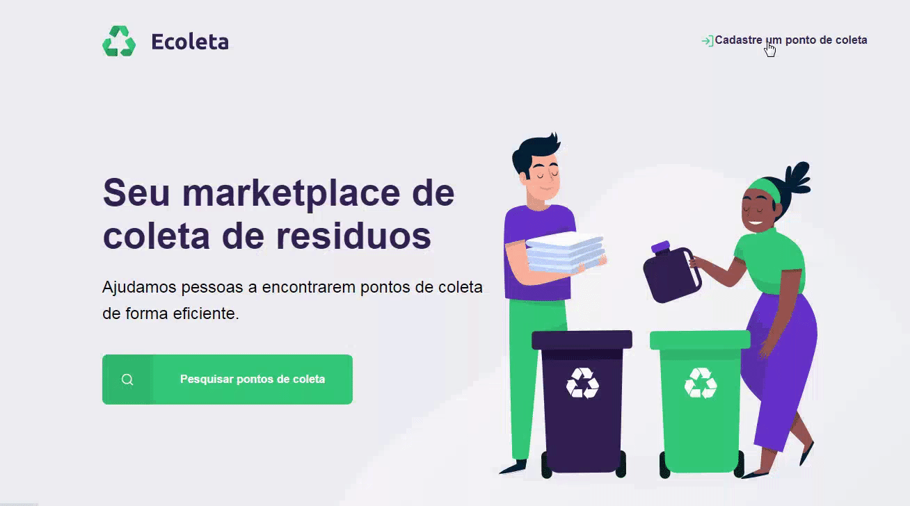
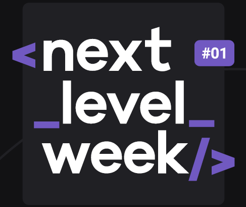

# _next_level_week_
<h1 align ="center">

</h1>

<h1 align = "center">
 <br>
 <br>


</h1>

# Index
- [_next_level_week_](#next_level_week)
- [Index](#index)
  - [But what are this?](#but-what-are-this)
  - [The Project](#the-project)
  - [Technology Used](#technology-used)
  - [How to download the project](#how-to-download-the-project)

## But what are this? 
NLW is a week-long online experience created by **Rocketseat** with lots of practical content, challenges, hacks and a project that will allow me to move to the next level and boost my career.<br>
**Duration: 5 days**

---

## The Project
**The Ecoleta project** is a website created to manage the garbage collection process in cities. With it, it is possible to help people find collection points in a more efficient and sustainable way, adding value to the sustainable development of cities.

---

## Technology Used

The project was developed using the following technologies:

- [HTML](https://www.w3schools.com/html/)
- [CSS](https://developer.mozilla.org/pt-BR/docs/Web/CSS)
- [Javascript](https://developer.mozilla.org/pt-BR/docs/Aprender/JavaScript)
- [NodeJS](https://nodejs.org/)
- [JSON](https://www.json.org/json-pt.html)
- [SQLite](https://www.sqlite.org/index.html)

---

## How to download the project

```bash
    # Clone repository
    $ git clone https://github.com/leandross86/_next_level_week_

    # Enter directory
    $ cd NLW

    #Install the dependencies
    $ npm install

    # Start project
    $ npm start
```
---

Developed by Leandro Souza

---

<h1 align = "center">

</h1>
